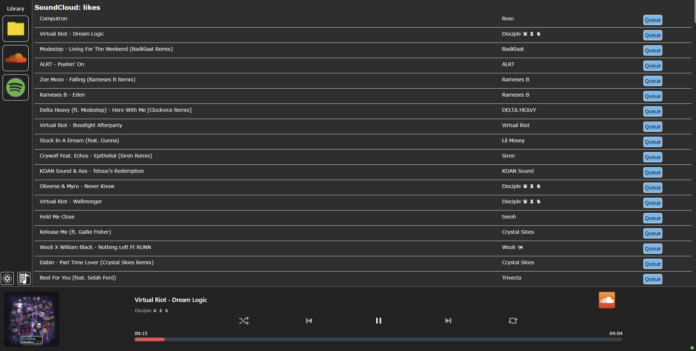
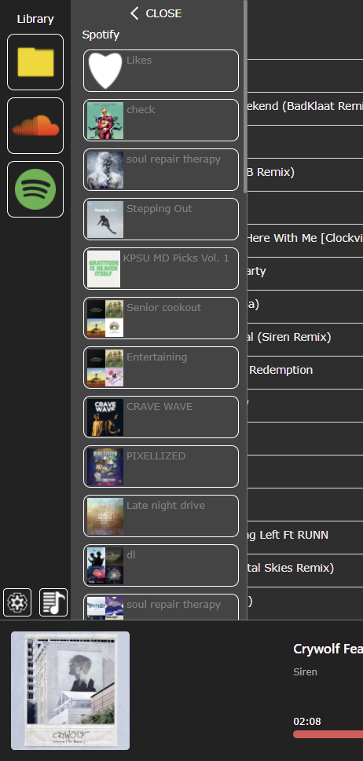
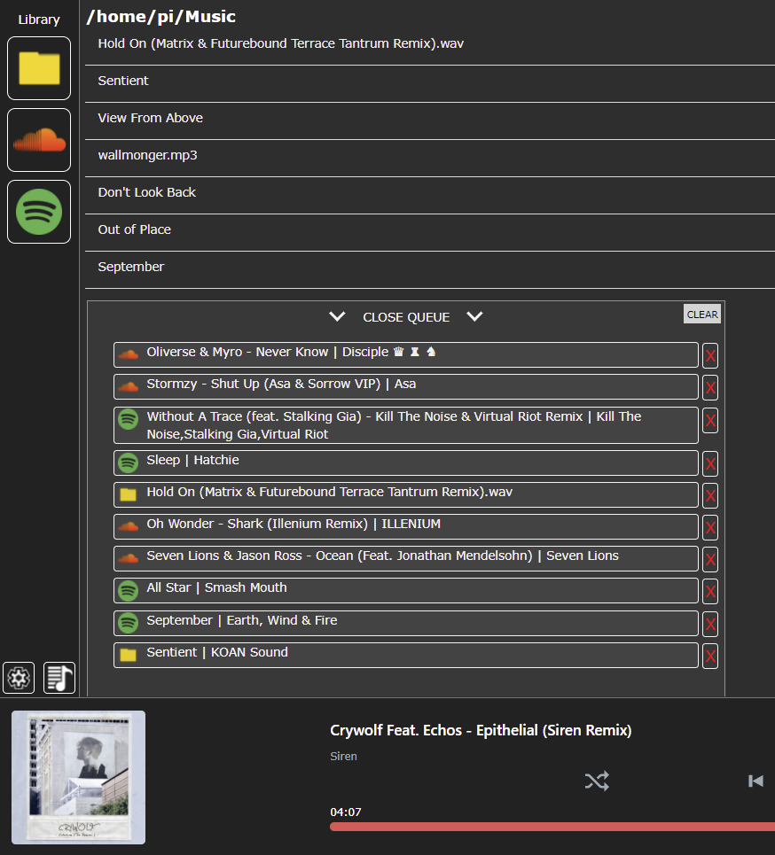
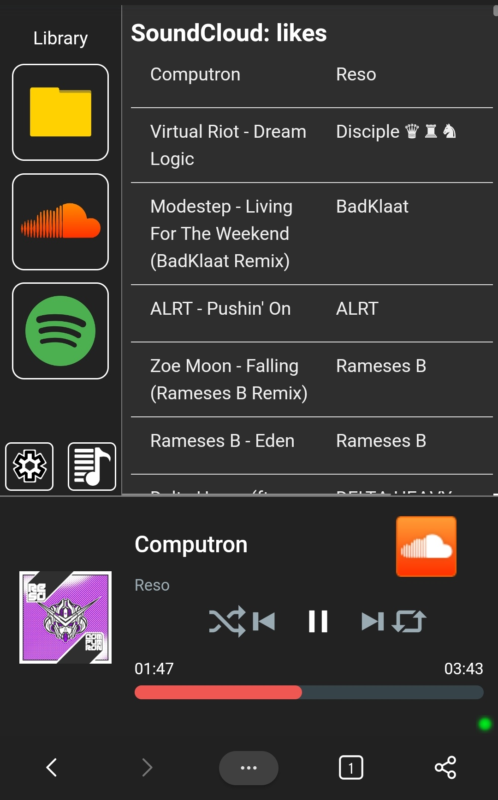
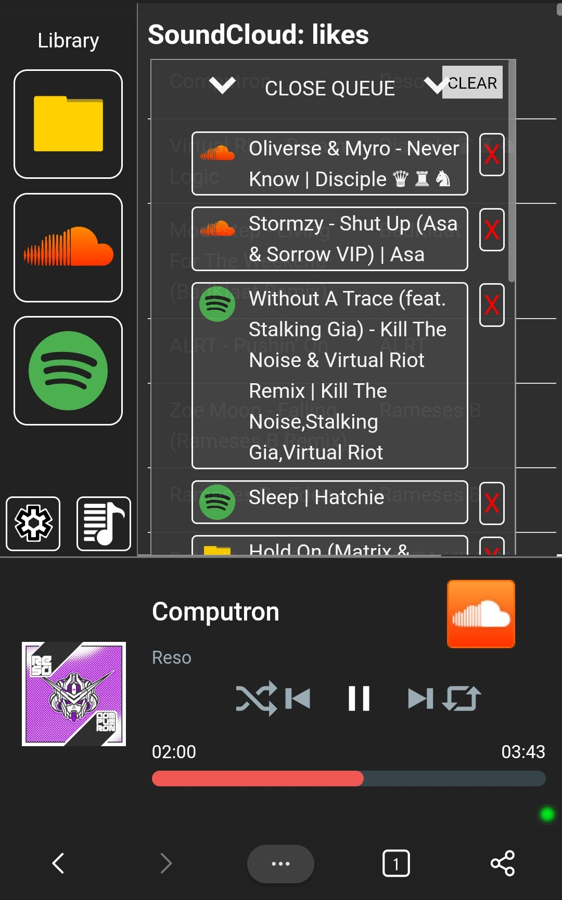

# Pi-Music-Srv
Another Raspberry Pi music server, this time using Node.js!

### Features:
 - Load, queue, and play music from SoundCloud, Spotify, and your local mp3/wav/flac files to the speakers connected to your Raspberry Pi
 - Realtime web app that syncs between devices, allowing you to change what's playing from anywhere in your house or allow multiple people to curate a playlist at once

### How to get it running on your Raspberry Pi:
 - I'll update this section with the steps to get it going over the next few weeks when I have it better suited for setting up on a new Pi (maybe a script?)
 - Note:  The cert + key added to the repo are an unsigned dummy pair used for testing, and you will need to click "advanced options" and "proceed" when first visiting the server in a browser

### Example screenshots of the web app on desktop and mobile:

#### Main player

#### Main player side panel for music selection and queue panel
 . . . . . . . . . . 

#### Mobile player and mobile player queue
 . . . . . . . . . . 

# Scripts
A couple of the Python scripts I use:
 - pi-power-button | Adds a power button to the Raspberry Pi, as well as blinking a power LED when powering off (based on: https://github.com/Howchoo/pi-power-button )
     - Contains scripts to add and remove from boot using init.d
 - pi-power-led | Turns on a power LED when the Pi boots up
     - Can be added to any startup method that allows GPIO access (I use rc.local, see pi-volume-control)
 - pi-volume-control | Uses two GPIO buttons to raise and lower the alsa mixer volume, as well as muting it when both are pushed, with 4 LEDs to display the volume (mute, 40%+, 70%+, 90%+) (based on: https://gist.github.com/peteristhegreat/3c94963d5b3a876b27accf86d0a7f7c0 )
     - Add to startup by adding the script in a line to /etc/rc.local with an ampersand (ex. "/home/pi/Documents/pi-power-buttons.py &")
